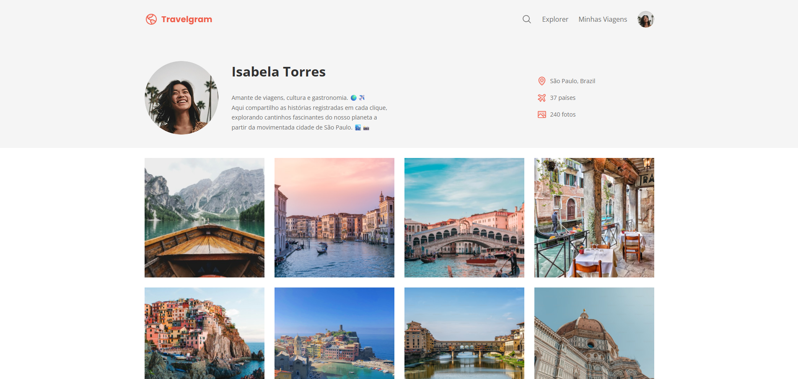

# ✈️ Travelgram - Perfil de Viagens

O **Travelgram** é uma página de perfil de rede social focada em fotografia de viagens.

Este projeto foi desenvolvido para praticar e consolidar conhecimentos em **HTML5 semântico** e **CSS3**, com foco em `box model`, variáveis CSS, importação de fontes externas e layouts flexíveis.

## 🔗 Links do Projeto

## 📸 Preview do Projeto

Abaixo, uma prévia do design final da página:

---

## 📝 Sobre o Projeto

Neste projeto, foram aplicados na prática os seguintes conceitos:

- **HTML5**: estrutura semântica (`header`, `main`, `nav`, `footer`)
- **CSS3**: uso de variáveis (`:root`), Flexbox para alinhamento e organização do layout
- **Google Fonts**: utilização da fonte *Poppins*
- **Ícones**: uso de Phosphor Icons (SVG)

### 🛠️ Funcionalidades e Ajustes

- **Layout responsivo**: ajustes para evitar distorção de imagens em diferentes tamanhos de tela
- **Tipografia**: definição de hierarquia visual entre títulos, bio e informações
- **Galeria**: organização das imagens com Flexbox e espaçamento uniforme utilizando `gap`

---

Desenvolvido por [Jessica França](https://github.com/jessicasfranca).
